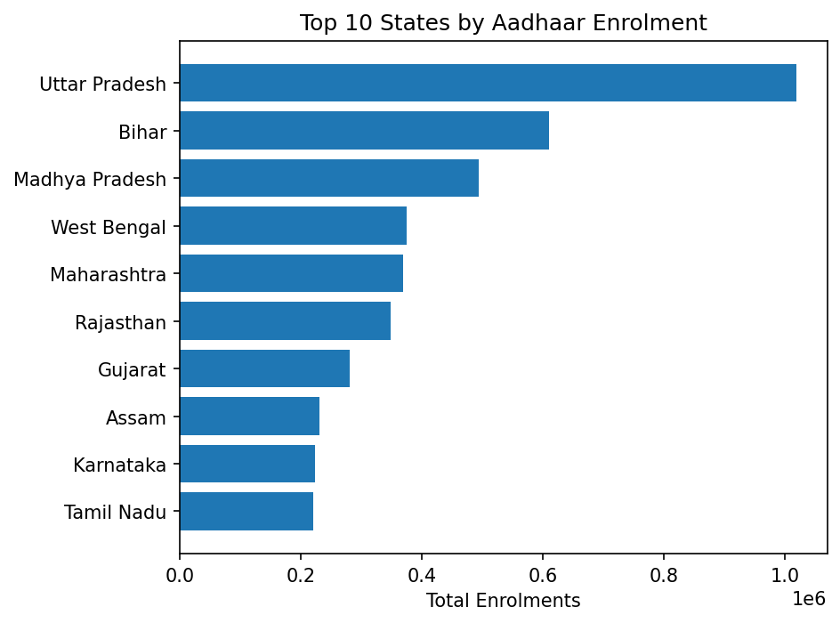

## UIDAI Aadhaar Data Analysis – Enrolment, Demographic & Biometric

This project explores **Aadhaar enrolment** and **update behaviour** (demographic and biometric) using UIDAI-provided datasets.  
The goal is to uncover **regional patterns**, **time-based trends**, **age-wise behaviour**, and **anomalies** that can guide **policy and system improvements**.

All analysis is implemented in **Python** using **Jupyter notebooks**.

---

## Project Structure

- `CODE/`
  - `Aadhaar_Enrolment_Analysis.ipynb`
  - `aadhar_demographic_analysis.ipynb`
  - `aadhar_biometric_analysis.ipynb`
- `DATA/`
  - `api_data_aadhar_enrolment/…`
  - `api_data_aadhar_demographic/…`
  - `api_data_aadhar_biometric/…`

> Open the notebooks directly on GitHub to view the code and **inline charts** rendered by nbviewer.

---

## 1. Aadhaar Enrolment Analysis

**Notebook**: `CODE/Aadhaar_Enrolment_Analysis.ipynb`  
**Dataset**: `DATA/api_data_aadhar_enrolment/*.csv`

### 1.1 Key Steps

- Combine all enrolment CSV files.
- Clean and standardise:
  - Parse `date`
  - Normalise `state`
  - Convert age-group columns to numeric
- Create:
  - `total_enrolments = age_0_5 + age_5_17 + age_18_greater`
  - `year`, `month` for time-series analysis.

### 1.2 Visualisations

- **Top 10 States by Aadhaar Enrolment**  
  Horizontal bar chart of `total_enrolments` by state.

- **Aadhaar Enrolment Trend Over Time**  
  Line chart of total monthly enrolments.

- **Age-wise Aadhaar Enrolment Distribution**  
  Bar chart comparing `age_0_5`, `age_5_17`, `age_18_greater`.

- **Anomaly Detection – State-wise Enrolment (IQR)**  
  Boxplot plus table of states with unusually high/low enrolments.

- **Enrolment Summary Dashboard**  
  Single-page figure showing:
  - Total enrolments
  - Number of states/UTs covered
  - Date range
  - Highest-enrolment state and its volume

### 1.3 Insights (High-level)

- Enrolment demand is **uneven across states**, with a few large states dominating volume.
- Enrolment shows **clear temporal surges** rather than a flat trend.
- The **18+ age group** contributes the largest share of enrolments.
- Anomaly analysis highlights states that may be **overloaded** or **under-utilising** enrolment infrastructure.

---

## 2. Aadhaar Demographic Updates Analysis

**Notebook**: `CODE/aadhar_demographic_analysis.ipynb`  
**Dataset**: `DATA/api_data_aadhar_demographic/*.csv`

### 2.1 Key Steps

- Load all demographic update CSVs into a single dataframe.
- Clean and transform:
  - Parse `date`
  - Standardise `state`, `district`
  - Handle missing values in `demo_age_5_17`, `demo_age_17_`
- Create:
  - `total_demo_updates = demo_age_5_17 + demo_age_17_`
  - `year`, `month`
- Aggregate:
  - `state_demo`: total demographic updates per state
  - `monthly_demo`: total monthly demographic updates
  - `district_demo`: total updates per state–district

### 2.2 Visualisations

- **Top 10 States by Aadhaar Demographic Updates**  
  Horizontal bar chart of `total_demo_updates` by state.

- **Trend of Aadhaar Demographic Updates Over Time**  
  Monthly line chart of total demographic updates.

- **Age-wise Distribution of Aadhaar Demographic Updates**  
  Bar chart comparing `demo_age_5_17` vs `demo_age_17_` (all-India totals).

- **Top 10 Districts by Aadhaar Demographic Updates**  
  Horizontal bar chart showing leading districts with state labels.

- **Anomaly Detection – State-wise Demographic Updates (IQR)**  
  Boxplot of state-level totals and a table of outlier states.

- **Aadhaar Demographic Updates – Summary Dashboard**  
  Shows:
  - Total demographic updates
  - Number of states/UTs and districts
  - Data period
  - Highest demographic-update state and its value

### 2.3 Insights (High-level)

- Demographic updates are **concentrated in a few states and districts**, often urban or high-migration hubs.
- Update volume over time shows **peaks**, likely linked to campaigns, scheme linkages, or migration cycles.
- Adults (18+) drive the majority of demographic updates, while child updates are smaller but policy-critical.
- Outlier states (very high or low) point to potential **infrastructure stress** or **access/awareness gaps**.

---

## 3. Aadhaar Biometric Updates Analysis

**Notebook**: `CODE/aadhar_biometric_analysis.ipynb`  
**Dataset**: `DATA/api_data_aadhar_biometric/*.csv`

### 3.1 Key Steps

- Combine biometric update CSVs into `Bio_df`.
- Clean:
  - Parse `date`
  - Standardise `state`, `district`
  - Handle missing values in `bio_age_5_17`, `bio_age_17_`
- Create:
  - `total_bio_updates = bio_age_5_17 + bio_age_17_`
  - `year`, `month`
- Aggregate:
  - `state_bio`: total biometric updates per state
  - `monthly_bio`: monthly biometric updates
  - `district_bio`: state–district level totals

### 3.2 Visualisations

- **Top 10 States by Aadhaar Biometric Updates**  
  Horizontal bar chart of `total_bio_updates` by state.

- **Trend of Aadhaar Biometric Updates Over Time**  
  Monthly time-series of biometric updates.

- **Age-wise Distribution of Aadhaar Biometric Updates**  
  Bar chart comparing `bio_age_5_17` vs `bio_age_17_`.

- **Top 10 Districts by Aadhaar Biometric Updates**  
  Horizontal bar chart with district and state labels.

- **Anomaly Detection – State-wise Biometric Updates (IQR)**  
  Boxplot and outlier state table for biometric updates.

- **Aadhaar Biometric Updates – Summary Dashboard**  
  Shows:
  - Total biometric updates
  - Number of states/UTs and districts
  - Data period
  - Highest biometric-update state and its volume

### 3.3 Insights (High-level)

- Biometric updates are **highly uneven**, with some states/districts doing heavy refresh and others very little.
- Time trends show **campaign-like surges** in biometric updates rather than steady refresh.
- Adults again dominate, but child/teen biometrics are crucial for long-term authentication reliability.
- Anomalies help flag states where **biometric quality risk** or **under-reporting** may be present.

---

## How to Run the Notebooks Locally

1. **Clone the repository**

```bash
git clone https://github.com/GajendraSingh33/DataAnalysis-UIDAI.git
cd DataAnalysis-UIDAI
```

2. **Create and activate a virtual environment (optional but recommended)**

```bash
python -m venv .venv
source .venv/bin/activate  # On Windows: .venv\Scripts\activate
```

3. **Install dependencies**

```bash
pip install pandas numpy matplotlib jupyter
```

4. **Launch Jupyter**

```bash
jupyter notebook
```

5. Open each notebook in `CODE/` and run all cells (`Kernel → Restart & Run All`) to generate all charts and dashboards.

---

## Suggested Figure Exports for GitHub

If you want static images of the plots visible directly in this README:

1. In Jupyter, after each plot is generated, save it as a PNG (e.g. `File → Save As` in the figure window or `plt.savefig("images/xxx.png")` before `plt.show()`).
2. Store all images under an `images/` folder, for example:
   - `images/enrolment_top_states.png`
   - `images/enrolment_trend.png`
   - `images/enrolment_age_distribution.png`
   - `images/enrolment_anomalies.png`
   - `images/enrolment_dashboard.png`
   - `images/demo_top_states.png`
   - `images/demo_trend.png`
   - `images/demo_age_distribution.png`
   - `images/demo_top_districts.png`
   - `images/demo_anomalies.png`
   - `images/demo_dashboard.png`
   - `images/bio_top_states.png`
   - `images/bio_trend.png`
   - `images/bio_age_distribution.png`
   - `images/bio_top_districts.png`
   - `images/bio_anomalies.png`
   - `images/bio_dashboard.png`

3. Then reference them in this README like:

```markdown

```

This will let visitors to your GitHub repository see the **key charts at a glance** without opening the notebooks.

---

## Intended Audience and Use

- **UIDAI / Government stakeholders**: for planning enrolment and update capacity, and monitoring performance.
- **Data analysts / students**: to learn how to perform EDA, anomaly detection, and dashboard-style summarisation on real public infrastructure data.
- **Researchers / policy teams**: to prototype models of enrolment and update demand and test policy ideas.

The notebooks are written to be **readable and modular**, so you can extend them with your own models (forecasting, clustering, risk scoring) as needed.

